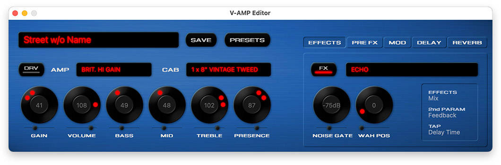
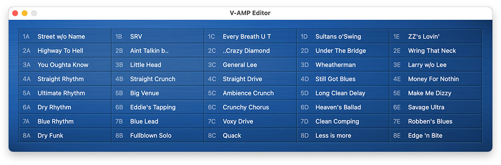

# V-AMP Editor for macOS

The editor Behringer never gave us ...

A macOS preset editor/librarian for the V-AMP PRO. Should also be compatible with V-AMP 2 and V-AMPIRE, but I have no device to test.

## Build from source
You’ll need the [Command Line Tools Package](https://developer.apple.com/library/archive/technotes/tn2339/_index.html) which you can install by running the `xcode-select --install` command in the terminal. Then simply run the included build script: `sh build.sh`

Tested on macOS 12, _should work_ on macOS 11 as well, but I finally gave up trying to make this work on earlier macOS versions.

## Thanks
This wouldn’t have been possible without the great work of [Gene De Lisa](https://github.com/genedelisa/SwiftMIDI).
You rock!
